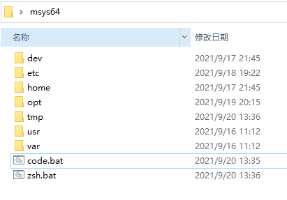

# 程序基础开发环境部署

## 下载环境

* [下载 Msys2 环境](https://github.com/msys2/msys2-installer/releases)
    > 下载文件 msys2-base-x86_64-[最新日期].tar.xz 压缩包
* [下载 VScode 编辑器](https://code.visualstudio.com/Download)
    > 下载系统版本的 .zip 压缩包文件

## 安装环境

* 基础安装
  1. 解压 [msys2-base-x86_64-20210916.tar.xz] 两次得到 Msys2 目录
  2. 解压 [VSCode-win32-x64-1.60.1.zip] 内容到 Msys2/opt/vscode 目录
    > 注意下载最新版
* 配置安装
  1. 运行 msys2.exe 进行初始化配置
  2. 运行 pacman -Syyu 进行环境升级
  3. 安装 pacman -S git 进行安装 git 操作
  4. 安装 pacman -S svn 进行安装 svn 操作
  5. 安装 pacman -S zsh 安装 zsh 命令行
  6. 运行命令
        > git clone https://github.com/zdharma/zinit.git ~/.zinit/bin  
        > echo > ~/.zshrc
* 配置 ~/.zshrc 文件
  
    ``` bash
    # 代理(可选没有代理国内 init 插件可能安装失败)
    #export https_proxy=127.0.0.1:8889
    # 解决 Zsh 初始化提示
    if (( ${UID} != 0 )); then
        n=1;
        IFS=':' arr=($(mkpasswd |grep $LOGNAME));
        for x in ${arr[@]}; do
            if [ $n -eq 3 ];then arr[$n]="0";fi;
            if [ $n -eq 4 ];then arr[$n]="0";fi;
            ((n++));
        done
        echo "$arr[1]:$arr[2]:$arr[3]:$arr[4]:$arr[5]:$arr[6]:/usr/bin/zsh" > /etc/passwd
        clear
        exit
    fi
    # 系统变量设置
    export HOMEDRIVE=${HomeDir}                               # 当前用户系统所在分区
    export HOMEPATH=${HOMEDRIVE}                              # 当前活动用户目录
    export USERPROFILE=${HOMEDRIVE}                           # 户配置文件的根目录
    #加载和核心
    source ~/.zinit/bin/zinit.zsh
    setopt no_nomatch
    setopt promptsubst
    # 单文件插件
    zinit ice svn multisrc"git.zsh history.zsh clipboard.zsh key-bindings.zsh theme-and-appearance.zsh"
    zinit snippet OMZ::/lib
    zinit ice svn multisrc"git.plugin.zsh"
    zinit snippet OMZ::/plugins/git
    zinit cdclear -q 
    # 加载插件
    zinit light -b zdharma/history-search-multi-word    # 历史关键字搜索
    zinit light -b zsh-users/zsh-syntax-highlighting    # 命令高亮
    zinit light -b paulirish/git-open                   # Git 扩展命令,在浏览器打开Git仓库
    # 补全插件
    zinit light -b zsh-users/zsh-autosuggestions        # 自动补全
    zinit ice blockf                                    #@ 设置补全
    zinit light -b zsh-users/zsh-completions            # 补全插件
    # 补全启用
    autoload -U compinit
    compinit
    # 主题
    GEOMETRY_COLOR_DIR=152
    zinit ice pick"geometry.zsh"
    zinit light geometry-zsh/geometry

    # ls 显示颜色
    alias ls="/bin/ls --color=tty --show-control-chars"
    alias ll='ls -l'
    alias la='ls -la'

    # Vscode 配置
    export ELECTRON_RUN_AS_NODE=1
    export RootDir=$(cygpath -w /opt)
    export PATH=${PATH}:${RootDir}\\VScode\\bin
    # 参数判定,如果有参数则执行
    # 注: 此定义放到文件最后 
    if [ -n "$*" ] ;then
        eval $*
    fi
    ```

## 编写入口文件

* 编写 code.bat 文件

    ``` cmd
    @echo off
    setlocal EnableDelayedExpan

    set tmpStr="%*"
    set "tmpStr=%tmpStr:\=\\\\%"
    zsh.bat -c "source ~/.zshrc" -c code.cmd %tmpStr%
    ```

* 编写 zsh.bat 文件

    ``` cmd
    @echo off
    setlocal EnableDelayedExpansion
    "%~dp0usr/bin/mintty" -t "Zsh" "/usr/bin/zsh" --login  %*
    ```

## Vscode 替换默认终端(可选)

* > 打开文件: Msys2/opt/Data/WorkSpace/User/settings.json

``` json
/*-----------------替换默认终端-----------------------*/
"terminal.integrated.profiles.windows": {
    "zsh (login)": {
        "path": "zsh",
        "args": [
            "-l"
        ]
    }
},
"terminal.integrated.defaultProfile.windows": "zsh (login)",
```

## 推荐插件(可选)

1. [Bracket Pair Colorizer 代码提示增强](https://marketplace.visualstudio.com/items?itemName=CoenraadS.bracket-pair-colorizer)

## 环境搭建完成预览


