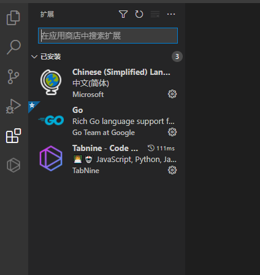
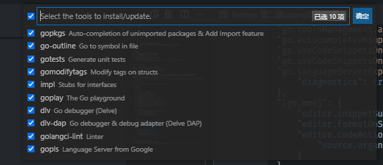

# Goang 环境搭建

## 下载 Golang

* [官方下载](https://golang.google.cn/dl/)
    > 下载 go[最新版本].windows-amd64.zip 并且解压到 Msys2/opt 目录下

## 配置 ~/.zshrc 文件

``` bash
# Go 设置
export GOENV=${RootDir}\\Data\\GOENV
export GOPATH=${RootDir}\\Data\\GOPATH
export GOROOT=${RootDir}\\Go
export GOCACHE=${RootDir}\\Data\\GOCACHE
export GOPROXY=https://goproxy.cn
export PATH=${PATH}:$(cygpath -u ${GOROOT}\\bin):$(cygpath -u ${GOPATH}\\bin)
```

## 设置 Vscode 插件

* 命令行输入 code 打开 Vscode 安装Go插件
  >  使用 Vscode 安装扩展 [Ctrl+Shift+X] 搜索  
  
  
* 所需要插件:
  * [Go](https://marketplace.visualstudio.com/items?itemName=golang.Go) 用于Golang相关的插件
  * [Tabnine Autocomplete AI](https://marketplace.visualstudio.com/items?itemName=TabNine.tabnine-vscode) 智能提示插件
  * 可选: [Go Asm](https://marketplace.visualstudio.com/items?itemName=quillaja.goasm) 用于Go汇编高亮
  
## 配置 Go 设置]

* > 打开文件: Msys2/opt/Data/WorkSpace/User/settings.json

1. 添加内容:

    ``` json
    "go.docsTool": "gogetdoc",
    "go.lintTool": "golangci-lint",
    "go.useLanguageServer": true,
    "go.gocodePackageLookupMode": "go",
    "go.gotoSymbol.includeGoroot": true,
    "go.gotoSymbol.includeImports": true,
    "go.toolsManagement.autoUpdate": true,
    "go.autocompleteUnimportedPackages": true,
    "go.useCodeSnippetsOnFunctionSuggest": true,
    "go.useCodeSnippetsOnFunctionSuggestWithoutType": true,
    "go.languageServerExperimentalFeatures": {
        "diagnostics": true,
    },
    "[go.mod]": {
        "editor.snippetSuggestions": "inline",
        "editor.formatOnSave": true,
        "editor.codeActionsOnSave": {
            "source.organizeImports": true
        }
    },
    "[go]": {
        "editor.snippetSuggestions": "inline",
        "editor.formatOnSave": true,
        "editor.codeActionsOnSave": {
            "source.organizeImports": true,
        }
    },
    "gopls": {
        "usePlaceholders": true,
        "staticcheck": false,
        "completionDocumentation": true , 
        "ui.semanticTokens": true,
    },
    ```

2. 重启 VsCode 安装 Go 工具
   1. 快捷键 Shift+Ctrl+P 打开命令窗口
   2. 输入 Go:install/Updata Tools 后全选安装插件  
        
   3. 等待安装完成
